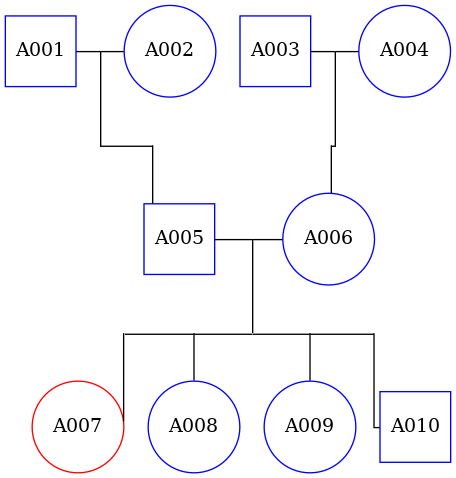

# ped2dot
Python program allowing to automaticaly produce a genealogical tree and the associated dot file from a pedigree file.

## Using the CLI:

    ./exec_ped2dot.py <input_file>

Exemple (contained into the Makefile):

    ./exec_ped2dot.py exemple_family.tfam

Allow the creation of this tree:

## Using directly in your programs:

    from ped2dot.ped2dot import ped_to_dot

    ped_to_dot("path to your pedigree file")

## Supported pedigree format:
For the moment, the only format supported is the [.fam format](https://www.cog-genomics.org/plink2/formats#fam).
This format need no header line, and tab separators.
Six columns are used to describe each individual, in this precise order:
- Family ID
- Individual ID (Unique ID, cannot be 0)
- Father ID (0 if unknown)
- Mother ID (*0 if unknown)
- Sex (1 = male, 2 = female, 0 = unknown)
- Phenotype (1 = control, 2 = case, 0 = unknown)

NaN can be used instead of 0 for unknown values.

## Used packages:
- pandas
- graphviz

For the CLI:
- docopt

## Version:
1.1.3

## Next improvements:
- Better code documentation
- Improved visualisation in case of individuals without children
- Packaging on Pypi
